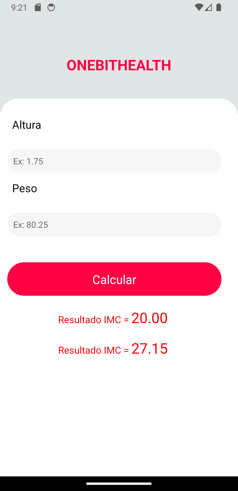
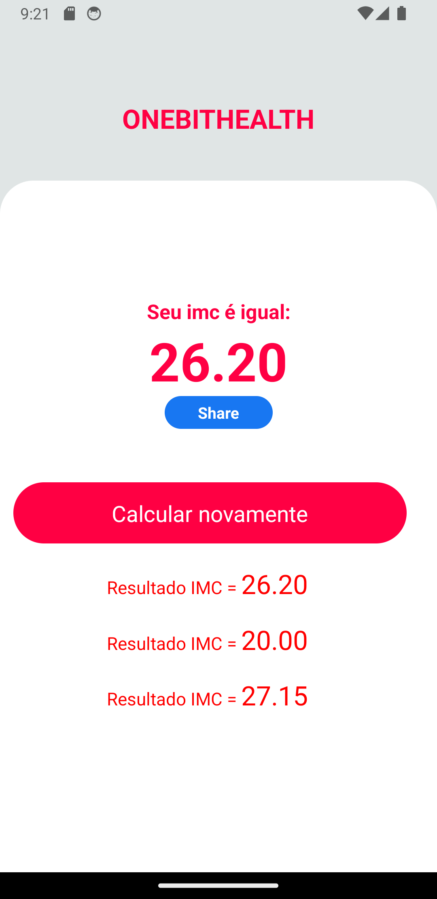

# React Native

Repositório para a primeira parte das aulas de [React Native](https://youtube.com/playlist?list=PLdDT8if5attEd4sRnZBIkNihR-_tE612_)

O aplicativo é uma calculadora de IMC (Índice de massa corpórea), e incorpora outras funções da API do React Native, como vibração.

